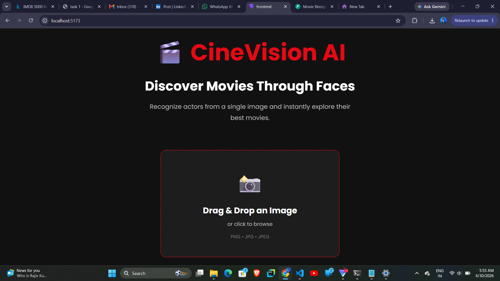
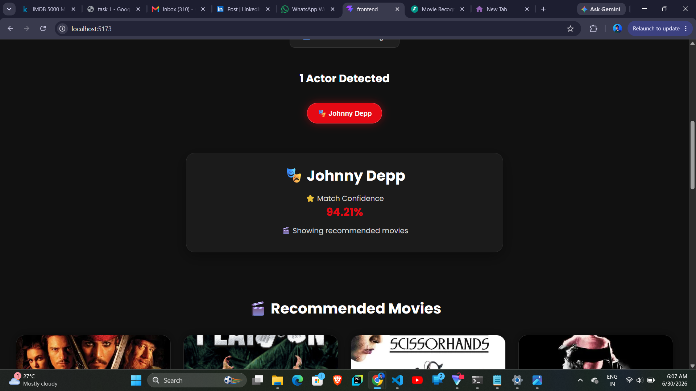
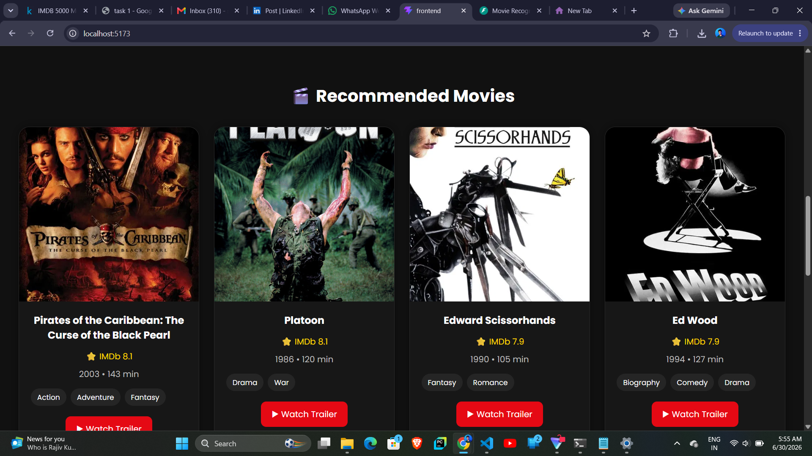
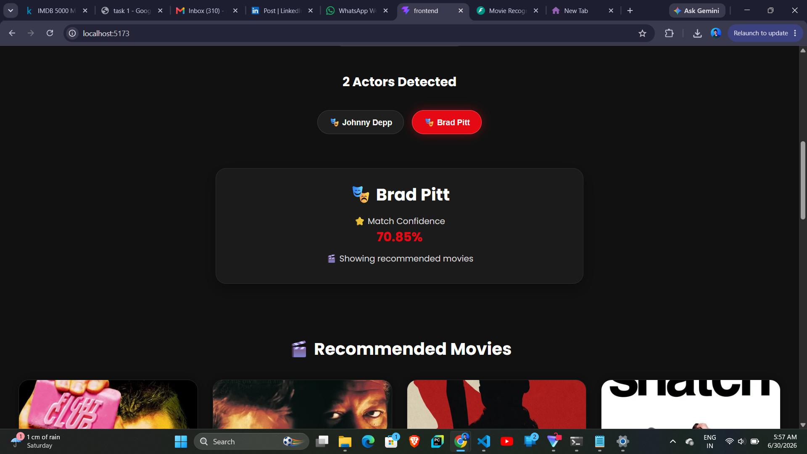
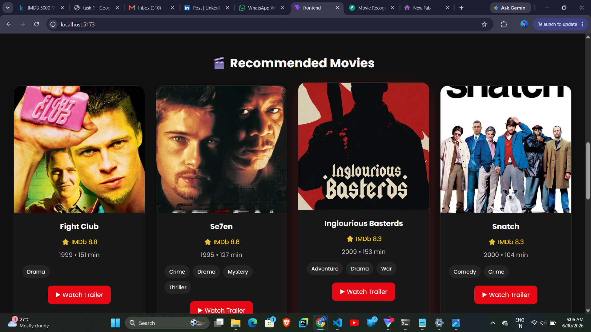
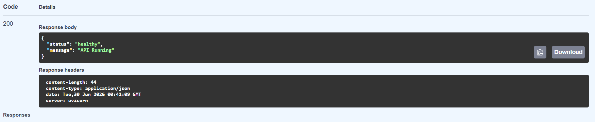
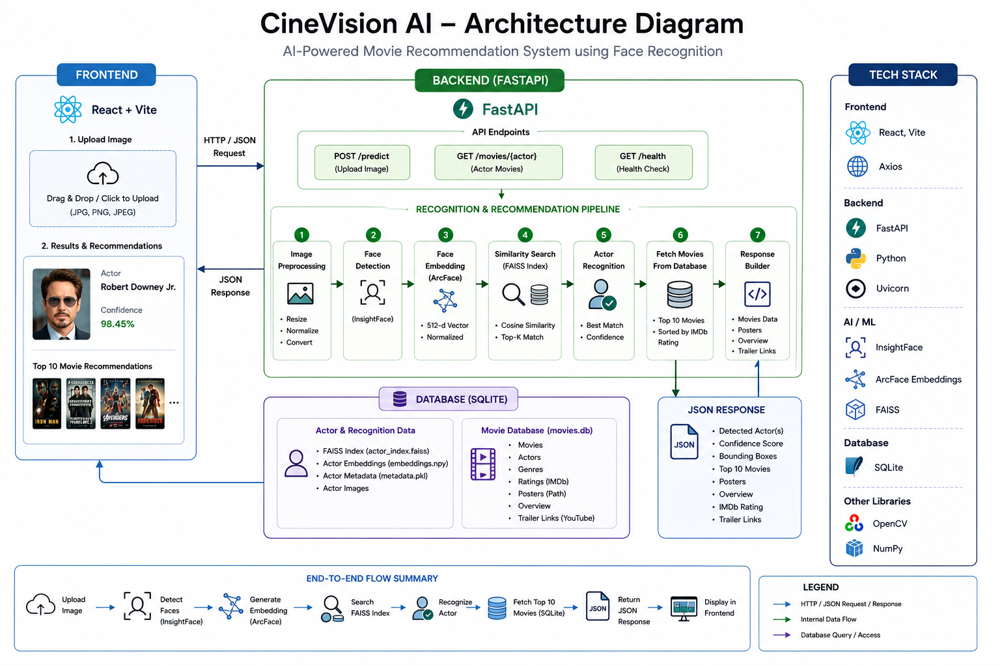

# 🎬 CineVision AI

An AI-powered movie recommendation system that recognizes actors from uploaded images using deep face recognition and recommends their highest-rated movies.

---

# Demo

Live Demo
> https://cine-vision-ai.vercel.app
---

# Screenshots

## Home Page




---

## Actor Recognition
Confidence


Recommendation


---

## Multiple Face Detection

Actor Named Buttons



---

## API Documentation

> Swagger UI



---

# Architecture

The following diagram illustrates the end-to-end architecture of the CineVision AI system.



# Features

- Upload JPG, PNG and JPEG images
- Automatic face detection
- Multi-face recognition
- Actor recognition using InsightFace (ArcFace)
- Actor selection for group photos
- Top 10 movie recommendations
- IMDb ratings
- Genres
- Runtime
- Movie overview
- Movie posters
- YouTube trailer links
- FastAPI REST APIs
- React frontend
- Prediction caching
- Docker support

---

# Tech Stack

## Backend

- Python
- FastAPI
- SQLite
- OpenCV
- InsightFace
- FAISS

## Frontend

- React
- Vite
- Axios
- CSS

## AI / ML

- ArcFace Embeddings
- InsightFace
- FAISS Vector Search
- Cosine Similarity Search

---

# Project Structure

```text
movie-recognition-engine/

│── backend/
│── frontend/
│── docker-compose.yml
│── README.md
```

---

# Workflow

1. Upload an image.
2. Detect all faces using InsightFace.
3. Generate ArcFace embeddings.
4. Search the FAISS index.
5. Recognize the actor.
6. Query SQLite for movies.
7. Rank movies by IMDb rating.
8. Return recommendations to the React frontend.

---

# REST APIs

## GET /health

Returns backend health status.

---

## POST /predict

Recognizes actors from an uploaded image.

Returns:

- Actor Name
- Confidence
- Recommended Movies

---

## GET /movies/{actor}

Returns the Top 10 movies of the specified actor.

---

# Testing

The application was successfully tested for:

- ✅ JPG Upload
- ✅ PNG Upload
- ✅ JPEG Upload
- ✅ Invalid File Handling
- ✅ Single Face Detection
- ✅ Multiple Face Detection
- ✅ No Face Detection
- ✅ Actor Recognition
- ✅ Recommendation Engine
- ✅ REST APIs
- ✅ Backend Failure Handling

Detailed test results are available in:

```
docs/TEST_REPORT.md
```

---

# Docker

Docker support has been included.

```bash
docker compose up --build
```

---

## Key Achievements

- Generated embeddings for **6,255 actors**
- Created a FAISS index with **11,223 face embeddings**
- Supports **single and multiple face recognition**
- Returns **Top 10 IMDb-ranked movie recommendations**
- Built with **FastAPI + React + InsightFace + FAISS + SQLite**

# Future Improvements

- Cloud deployment
- User authentication
- Semantic movie search
- Personalized recommendations
- Actor biography integration
- Recommendation using LLMs
- Vector database integration

---

# Author

**Soyam Patra**

AI/ML Engineer Hiring Assignment

Andromeda Inc.
